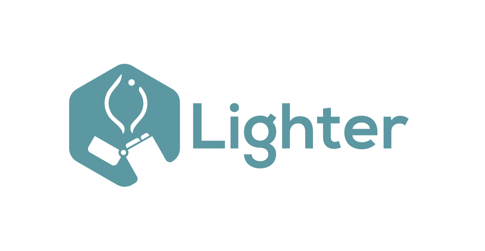

 

<picture>
  
</picture>

 
 

  

&nbsp;

Focus on your deep learning experiments and forget about (re)writing code. `lighter` is:
 1. **Task-agnostic**

    Classification, segmentation, or self-supervised learning? Lighter handles it all.

 2. **Configuration-based**

    Define, adjust, and reproduce experiments through configuration files.

 3. **Customizable**

    Integrate custom code seamlessly, whether it's models, datasets, or any other component.

&nbsp;

`lighter` stands on the shoulder of these two giants:
 - [MONAI Bundle](https://docs.monai.io/en/stable/bundle_intro.html) - Configuration system. Similar to [Hydra](https://github.com/facebookresearch/hydra), but with additional features.
 - [PyTorch Lightning](https://github.com/Lightning-AI/lightning) - Our [`System`](https://project-lighter.github.io/lighter/reference/system/) is based on the PyTorch Lightning [`LightningModule`](https://lightning.ai/docs/pytorch/stable/common/lightning_module.html) and implements all the necessary training logic for you. Couple it with the PyTorch Lightning [Trainer](https://lightning.ai/docs/pytorch/stable/common/trainer.html) and you're good to go.

 

Simply put, <code>lighter = config(trainer + system)</code>  😇

 

## 📖 Getting Started

  📚 <a href="https://project-lighter.github.io/lighter/"> Documentation</a>&nbsp;&nbsp;&nbsp;
  🎥 <a href="https://www.youtube.com/channel/UCef1oTpv2QEBrD2pZtrdk1Q">YouTube Channel</a>&nbsp;&nbsp;&nbsp;
  👾 <a href="https://discord.gg/zJcnp6KrUp">Discord Server</a>

<b>Install:</b>
<pre><code>pip install project-lighter</code></pre>

<b>Install pre-release</b>

Get the latest features and fixes from the main branch.

<pre>
<code>pip install project-lighter --pre</code>
</pre>

<b>Development:</b>

To contribute to the project, clone the repository and run the following commands. Also, refer to the <a href="CONTRIBUTING.md">contributing guide</a>.

<pre>
<code>make setup
make install             # Install lighter via uv
make pre-commit-install  # Set up the pre-commit hook for code formatting</code>
</pre>

 

## 💡 Projects
Projects that use `lighter`:

| Project | Description |
| --- | --- |
| [Foundation Models for Quantitative Imaging Biomarker Discovery in Cancer Imaging](https://aim.hms.harvard.edu/foundation-cancer-image-biomarker) | A foundation model for lesions on CT scans that can be applied to down-stream tasks related to tumor radiomics, nodule classification, etc. |

 

## Cite
<pre><code>@software{lighter,
author       = {Ibrahim Hadzic and
                Suraj Pai and
                Keno Bressem and
                Hugo Aerts},
title        = {Lighter},
publisher    = {Zenodo},
doi          = {10.5281/zenodo.8007711},
url          = {https://doi.org/10.5281/zenodo.8007711}
}</code></pre>

