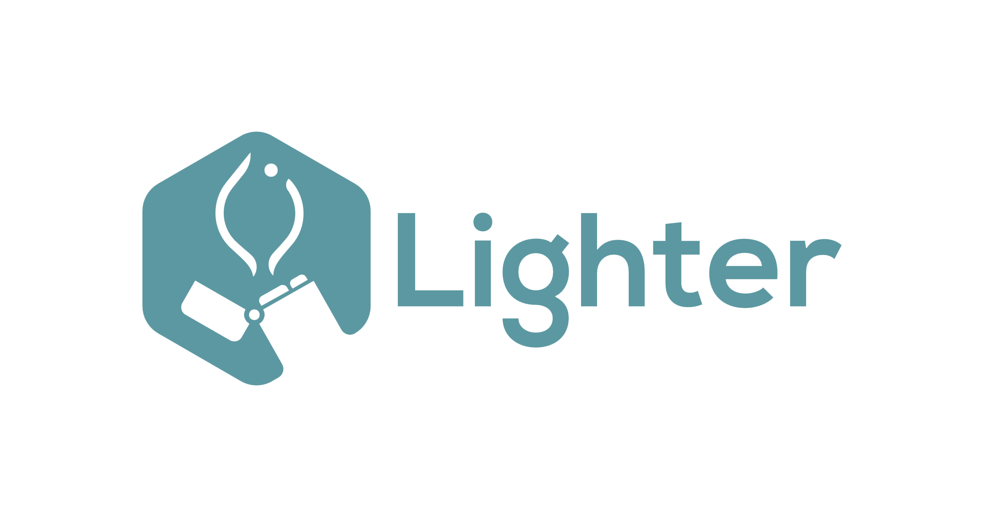

<div align="center">
  
</div>
<br/><br/>
<p align="center">
  <a href="https://github.com/project-lighter/lighter/actions/workflows/ci.yml"></a>
  <a href="https://codecov.io/gh/project-lighter/lighter"></a>
  <a href="https://pypi.org/project/lighter/"></a>
  <a href="https://github.com/project-lighter/lighter/blob/main/LICENSE"></a>
  <a href="https://project-lighter.github.io/lighter"></a>
  <a href="https://discord.gg/zJcnp6KrUp"></a>
</p>
<br/>

**Lighter** makes PyTorch Lightning experiments reproducible and composable through YAML configuration. Stop hardcoding hyperparameters—configure everything from the command line.

## Why Lighter?

You're already using PyTorch Lightning. But every experiment requires editing Python code to change hyperparameters:

```python
# Want to try a different learning rate? Edit the code.
optimizer = Adam(params, lr=0.001)  # Change this line

# Want to use a different batch size? Edit the code.
train_loader = DataLoader(dataset, batch_size=32)  # And this one

# Want to train longer? Edit the code again.
trainer = Trainer(max_epochs=10)  # And this one too
```

**With Lighter, configure everything in YAML and override from the CLI:**

```bash
# Try different learning rates without touching code
lighter fit config.yaml model::optimizer::lr=0.001
lighter fit config.yaml model::optimizer::lr=0.01
lighter fit config.yaml model::optimizer::lr=0.1

# Track the recipe together with code, environment and data identities
```

## Installation and a complete first experiment

This working branch is the paired development release **Lighter 0.2.0.dev0 / Sparkwheel 0.1.0.dev0**. It requires Sparkwheel's retained-construction API; older published Sparkwheel versions are incompatible. Nothing in the local build workflow publishes packages.

With both reviewed source checkouts available, use Python 3.11 and [uv](https://docs.astral.sh/uv/getting-started/installation/):

```bash
python scripts/check_paired_install.py \
  --sparkwheel /path/to/sparkwheel \
  --python /path/to/python3.11 \
  --output /path/to/project-lighter/artifacts/reference-pair
```

The output and optional `--environment` paths must be new and outside both source checkouts. The script builds both packages, generates a hash-locked environment, installs their wheels, checks imports from site-packages, and executes the complete fit/test/predict/resume workflow with inspection and records. `--dry-run` prints the plan; `--profile numpy2` selects the additional tested profile. Dependency downloads may require network access.

See [compatibility and local installation](docs/guides/compatibility.md) for exact profiles, editable development, registry-only CI limitations and the release sequence. The generated lock is a concrete local artifact lock; broad package version bounds are not a claim that every possible dependency combination has been tested.

Start with the [download-free CPU experiment](projects/tabular_regression/README.md), which verifies checkpoint progress, exact prediction IDs and values, and continuation. Existing native Lightning code remains supported. Place empty `__lighter__.py` and `__init__.py` files next to `model.py`, then run from that project directory:

```python
# model.py
import torch
import torch.nn.functional as F
import pytorch_lightning as pl


class MyModel(pl.LightningModule):
    def __init__(self, network, learning_rate=0.001):
        super().__init__()
        self.network = network
        self.lr = learning_rate

    def training_step(self, batch, batch_idx):
        x, y = batch
        loss = F.cross_entropy(self.network(x), y)
        self.log("train/loss", loss)
        return loss

    def configure_optimizers(self):
        return torch.optim.Adam(self.parameters(), lr=self.lr)
```

**Configure in YAML instead of hardcoding:**

```yaml
# config.yaml
trainer:
  _target_: pytorch_lightning.Trainer
  max_epochs: 10

model:
  _target_: project.model.MyModel
  network:
    _target_: torchvision.models.resnet18
    num_classes: 10
  learning_rate: 0.001

data:
  _target_: lighter.LighterDataModule
  train_dataloader:
    _target_: torch.utils.data.DataLoader
    batch_size: 32
    dataset:
      _target_: torchvision.datasets.CIFAR10
      root: ./data
      train: true
      download: true
      transform:
        _target_: torchvision.transforms.ToTensor
```

**Run and iterate fast:**

```bash
# Run your experiment
lighter fit config.yaml

# Try different hyperparameters - no code editing needed
lighter fit config.yaml model::learning_rate=0.01
lighter fit config.yaml trainer::max_epochs=50
lighter fit config.yaml data::train_dataloader::batch_size=64

# Use multiple GPUs
lighter fit config.yaml trainer::devices=4

# Local attempt records and source snapshots default to
# trainer.default_root_dir/lighter_runs/ATTEMPT_ID/
```

## Key Benefits

- **Inspectable**: Preserve recipes and observed native state in local attempt records; version code, dependencies and data alongside them.
- **Fast iteration**: Override any parameter from CLI without editing code.
- **Zero lock-in**: Works with any PyTorch Lightning module. Your code, your logic.
- **Composable**: Merge configs, create recipes, share experiments as files.
- **Organized**: Local attempt IDs and explicit checkpoint/prediction paths, including without an external logger.
- **Native**: Lightning owns training loops and strategy behavior; familiar scientific steps remain Python.

## Optional: Use LighterModule for Less Boilerplate

If you want automatic optimizer configuration and dual logging (step + epoch), use `LighterModule`:

```python
from lighter import LighterModule


class MyModel(LighterModule):
    def training_step(self, batch, batch_idx):
        x, y = batch
        pred = self(x)
        loss = self.criterion(pred, y)

        if self.train_metrics:
            self.train_metrics(pred, y)

        return {"loss": loss}  # Framework logs automatically

    # validation_step, test_step, predict_step...
```

```yaml
model:
  _target_: project.model.MyModel
  network:
    _target_: torchvision.models.resnet18
    num_classes: 10
  criterion:
    _target_: torch.nn.CrossEntropyLoss
  optimizer:
    _target_: torch.optim.Adam
    params: "$@model::network.parameters()"
    lr: 0.001
  train_metrics:
    _target_: torchmetrics.Accuracy
    task: multiclass
    num_classes: 10
```

**LighterModule gives you:**
- Automatic `configure_optimizers()` handling
- Automatic dual logging (step + epoch)
- Config-driven criterion and metrics

**But you still control:**
- All step implementations
- Loss computation logic
- When to call metrics

## Example: Running a Hyperparameter Sweep

```bash
# Run grid search without editing code
for lr in 0.001 0.01 0.1; do
  for bs in 32 64 128; do
    lighter fit config.yaml \
      model::optimizer::lr=$lr \
      data::train_dataloader::batch_size=$bs
  done
done

# Each run saved in outputs/YYYY-MM-DD/HH-MM-SS/ with config.yaml
# Compare experiments by diffing configs
```

## Documentation

- 📚 [Get Started Tutorial](https://project-lighter.github.io/lighter/tutorials/get-started/) - 15 min walkthrough
- ⚙️ [Configuration Guide](https://project-lighter.github.io/lighter/how-to/configuration/) - Master the syntax
- 🎯 [LighterModule Design](https://project-lighter.github.io/lighter/design/model/) - Understand the internals
- 🏗️ [Architecture Overview](https://project-lighter.github.io/lighter/design/overview/) - How it all works

## Real-World Usage

- 🏥 [Foundation Models for Cancer Imaging](https://aim.hms.harvard.edu/foundation-cancer-image-biomarker)
- 🧠 [Vision Foundation Models for CT](https://arxiv.org/abs/2501.09001)

## Community

- 💬 [Discord](https://discord.gg/zJcnp6KrUp) - Chat with users
- 🐛 [GitHub Issues](https://github.com/project-lighter/lighter/issues) - Report bugs
- 📺 [YouTube](https://www.youtube.com/channel/UCef1oTpv2QEBrD2pZtrdk1Q) - Video tutorials
- 🤝 [Contributing](CONTRIBUTING.md) - Help improve Lighter

## Citation

If Lighter helps your research, please cite our [JOSS paper](https://joss.theoj.org/papers/10.21105/joss.08101):

```bibtex
@article{lighter,
    doi = {10.21105/joss.08101},
    year = {2025}, publisher = {The Open Journal}, volume = {10}, number = {111}, pages = {8101},
    author = {Hadzic, Ibrahim and Pai, Suraj and Bressem, Keno and Foldyna, Borek and Aerts, Hugo JWL},
    title = {Lighter: Configuration-Driven Deep Learning},
    journal = {Journal of Open Source Software}
}
```
