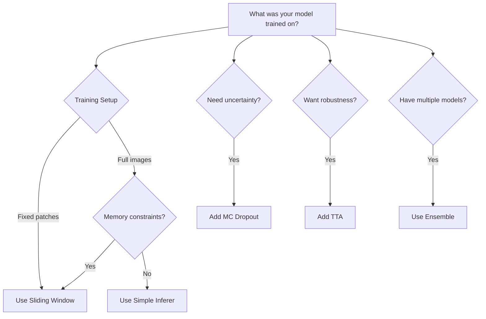

# Inferers: Bridging Training and Inference

Inferers adapt how your model processes data at inference time based on how it was trained and what your deployment needs are. Lighter's inferer system handles these adaptations seamlessly.

## Why Inferers Matter 🎯

The way you train a model often differs from how you need to use it:

| Training Scenario | Inference Challenge | Solution (Inferer) |
|------------------|--------------------|--------------------|
| Trained on fixed-size patches | Need to process full images | **Sliding Window** - breaks large images into patches |
| Trained on clean data | Noisy test data | **Test-Time Augmentation** - average multiple predictions |
| Single model | Need confidence scores | **Monte Carlo Dropout** - uncertainty estimation |
| Multiple models trained | Want best performance | **Ensemble** - combine predictions |

## Common Inference Patterns

### Sliding Window Inference
**When to use:** Your model was trained on fixed-size patches but you need to process larger images/volumes

**Why it works:** The model only knows how to process the patch size it was trained on

**Example:** A model trained on 256×256 patches from CT scans needs to process full 512×512×400 volumes

### Test-Time Augmentation (TTA)
**When to use:** You want more robust predictions and can afford extra compute time

**Why it works:** Averaging predictions from augmented inputs reduces noise

**Example:** Medical image segmentation where rotation/flip invariance improves boundaries

### Monte Carlo Dropout
**When to use:** You need uncertainty estimates along with predictions

**Why it works:** Dropout at inference creates an ensemble effect

**Example:** Medical diagnosis where you need to know prediction confidence

## Configuring Inferers in Lighter

You can configure any custom inferer within the `system.inferer` section of your `config.yaml` file. The inferer can be any callable that takes the model and input, then returns predictions.

#### Configuration

Here's an example of a basic inferer configuration:

```yaml title="config.yaml"
system:
  inferer:
    _target_: my_project.inferers.CustomInferer
    # Add any arguments your inferer needs
```

When an inferer is configured, Lighter automatically uses it during the `forward` pass in validation, test, and predict modes.

## Implementing a Custom Inferer

You can implement custom inference logic to handle:

*   **Advanced Ensembling Strategies:** Implementing ensembling techniques beyond simple averaging.
*   **Sliding Window Inference:** Processing large images in patches.
*   **Test-Time Augmentation:** Averaging predictions across augmentations.
*   **Highly Specialized Output Processing:** Tailoring output processing to your unique research problem.

To implement a custom inferer in Lighter, you'll create a Python class that adheres to a specific structure.

### Custom Inferer Class Structure

```python title="my_project/inferers/my_custom_inferer.py"
from typing import Any

import torch
from torch.nn import Module

class MyCustomInferer:
    def __init__(self, arg1, arg2, **kwargs):
        """
        Initialize your custom inferer.

        Args:
            arg1: Custom argument 1.
            arg2: Custom argument 2.
            **kwargs: Additional keyword arguments.
        """
        self.arg1 = arg1
        self.arg2 = arg2
        #... initialize any internal components...

    def __call__(self, inputs: torch.Tensor, network: Module, *args: Any, **kwargs: Any) -> torch.Tensor:
        """
        Perform inference using your custom logic.

        Args:
            inputs: Input tensor(s) to the model.
            network: The deep learning model (torch.nn.Module).
            *args: Additional positional arguments (if needed).
            **kwargs: Additional keyword arguments (if needed).

        Returns:
            torch.Tensor: The processed prediction tensor(s).
        """
        # Implement your custom inference logic here
        # This could include:
        #   - Test-time augmentation
        #   - Model ensembling
        #   - Sliding window or patch-based inference
        #   - Any other custom processing

        # Example: Simple forward pass with optional post-processing
        outputs = network(inputs, *args, **kwargs)
        processed_outputs = self.post_process(outputs)
        return processed_outputs

    def post_process(self, outputs: torch.Tensor) -> torch.Tensor:
        """
        Optional post-processing of model outputs.

        Args:
            outputs (torch.Tensor): Raw model output tensor(s).

        Returns:
            torch.Tensor: Processed output tensor(s).
        """
        # Implement post-processing logic if needed (e.g., thresholding, softmax)
        return outputs
```

### Key Components

1.  **`__init__`:**
    *   This is the constructor of your inferer class.
    *   It takes any custom arguments that you can define in your `config.yaml`.
    *   Use this method to initialize any internal components or parameters your inferer needs.

2.  **`__call__`:**
    *   This method makes your class callable like a function, enabling it to be used directly for inference.
    *   **Arguments:**
        *   `inputs (torch.Tensor)`: The input tensor(s) to your model.
        *   `network (torch.nn.Module)`: Your deep learning model (equivalent to `self.model` in your `System`).
        *   `*args`, `**kwargs`:  These allow you to pass additional arguments if required, although they are not typically used in inferers.
    *   **Logic:**
        *   This is where you implement your core inference logic.
        *   A common pattern is to perform a forward pass through your `network` using  `outputs = network(inputs)`.
        *   You can integrate various inference techniques here, such as TTA, ensembling, or sliding window inference.
        *   You can also call a `post_process` method to further refine the model's raw outputs.
    *   **Return Value:**
        *   This method must return the processed prediction tensor(s) as a `torch.Tensor`. This output will be used as the `pred` value in your validation, testing, or prediction steps.

3.  **`post_process` (Optional):**
    *   This is an optional method for applying post-processing operations to the model's raw outputs.
    *   You can use it for tasks like thresholding, applying a softmax function, or any other custom processing relevant to your problem.
    *   If no post-processing is required, you can simply return the `outputs` tensor directly.

#### Integrating a Custom Inferer

1.  **Save:** Save your custom inferer class (e.g., `MyCustomInferer`) in a Python file within your project (e.g., `my_project/inferers/my_custom_inferer.py`).

2.  **Configure:**  In your `config.yaml`, specify the inferer within the `system.inferer` section, providing the path to your class and any necessary arguments for its `__init__` method:

    ```yaml title="config.yaml"
    system:
      inferer:
        _target_: my_project.inferers.my_custom_inferer.MyCustomInferer
        arg1: value1
        arg2: value2
    ```

    *   **`_target_`:** Points to your custom inferer class.
    *   **`arg1` and `arg2`:**  Arguments passed to your inferer's `__init__` method.

With this configuration, Lighter will create an instance of your custom inferer and use it during the appropriate stages of your experiment.

## Example: Test-Time Augmentation Inferer

```python
# my_project/inferers/tta_inferer.py
import torch
import torchvision.transforms.functional as TF
from torch.nn import Module

class TTAInferer:
    """Test-Time Augmentation for robust predictions."""
    def __init__(self, num_augmentations=4, aggregate="mean"):
        self.num_augmentations = num_augmentations
        self.aggregate = aggregate

    def __call__(self, inputs: torch.Tensor, network: Module) -> torch.Tensor:
        predictions = []

        # Define augmentations
        augmentations = [
            lambda x: x,  # Original
            lambda x: TF.hflip(x),  # Horizontal flip
            lambda x: TF.vflip(x),  # Vertical flip
            lambda x: torch.rot90(x, k=2, dims=[-2, -1])  # 180 rotation
        ]

        for aug_fn in augmentations[:self.num_augmentations]:
            # Apply augmentation
            aug_input = aug_fn(inputs)

            # Get prediction
            with torch.no_grad():
                pred = network(aug_input)

            # Reverse augmentation on prediction
            if aug_fn != augmentations[0]:  # Skip original
                pred = aug_fn(pred)  # Most augmentations are self-inverse

            predictions.append(pred)

        # Aggregate predictions
        stacked = torch.stack(predictions)
        if self.aggregate == "mean":
            return stacked.mean(dim=0)
        elif self.aggregate == "voting":
            votes = stacked.argmax(dim=-1)
            return torch.mode(votes, dim=0)[0]
        else:
            return stacked.mean(dim=0)
```

Use in config:
```yaml
system:
    inferer:
        _target_: my_project.inferers.TTAInferer
        num_augmentations: 4
        aggregate: mean
```

## Performance Tips ⚡

| Optimization | Technique | Impact |
|-------------|-----------|--------|
| **Batch TTA** | Process all augmentations in one batch | 2-3x faster |
| **Mixed Precision** | Use `torch.cuda.amp.autocast()` | 30-50% speedup |
| **Reduce Augmentations** | Use only most impactful transforms | Proportional speedup |

## Choosing the Right Inferer



## Configuration Examples

### Model Trained on Patches → Full Image Inference
```yaml
# Model was trained on 128×128×128 patches
# Now need to process 512×512×200 volumes
system:
  inferer:
    _target_: monai.inferers.SlidingWindowInferer
    roi_size: [128, 128, 128]  # Must match training patch size!
    sw_batch_size: 4
    overlap: 0.5  # 50% overlap for smooth predictions
    mode: gaussian  # Smooth blending at boundaries
```

### Adding Robustness with TTA
```yaml
# Model trained normally, but test data is noisier
system:
  inferer:
    _target_: my_project.inferers.TTAInferer
    num_augmentations: 4  # Balance speed vs robustness
    aggregate: mean  # Average predictions
```

### Uncertainty Quantification with MC Dropout
```yaml
# Model has dropout layers, need confidence intervals
system:
  inferer:
    _target_: my_project.inferers.MCDropoutInferer
    num_samples: 20  # Multiple forward passes
    return_std: true  # Return standard deviation as uncertainty
```

## Related Guides
- [Adapters](adapters.md) - Transform inference outputs
- [Writers](writers.md) - Save predictions
